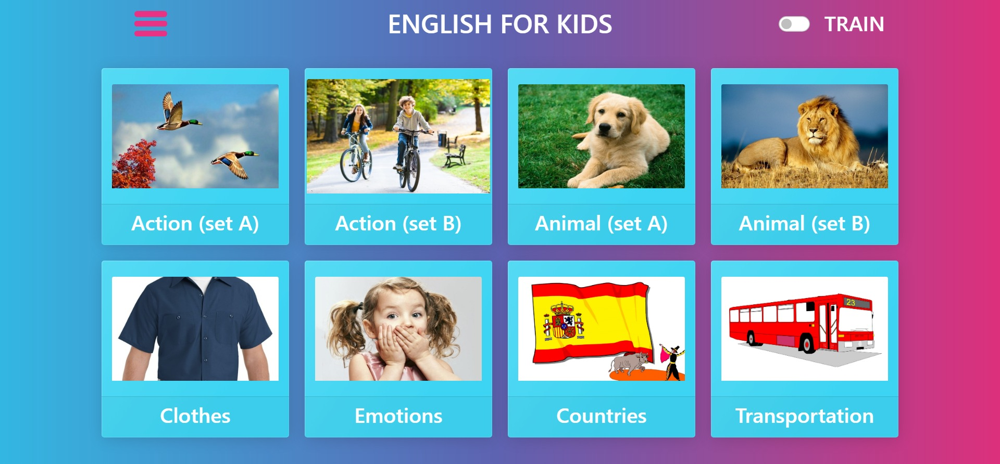
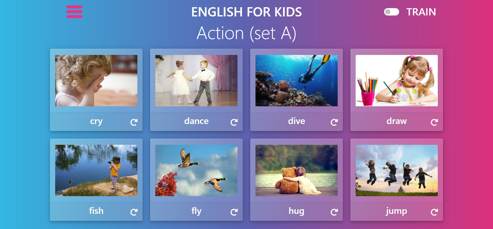
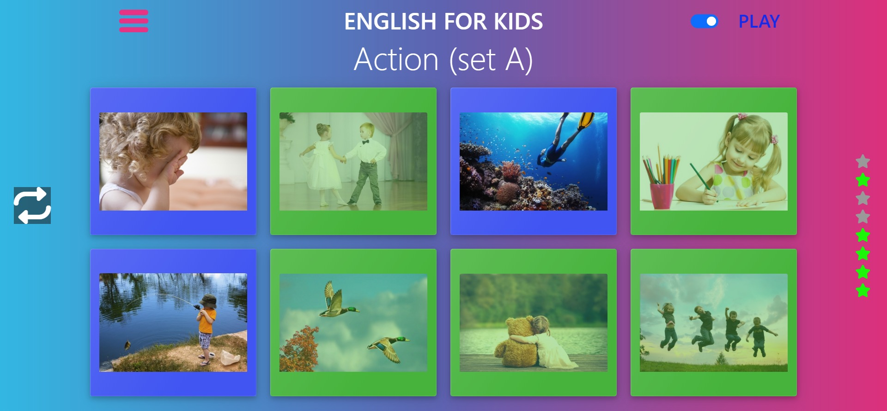
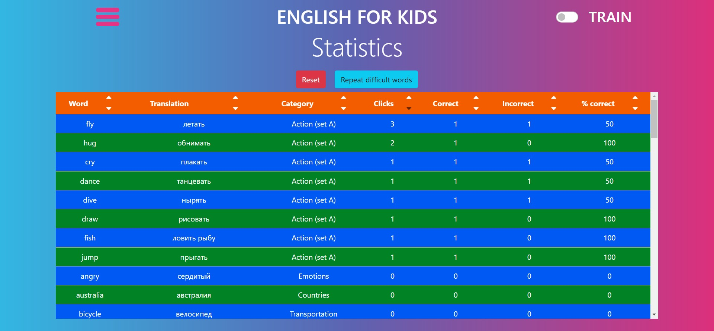

# English for Kids

English vocabulary learning application for kids

## Table of contents
* [General info](#general-info)
* [Screenshots](#screenshots)
* [Technologies](#technologies)
* [Setup](#setup)
* [Demo](#demo)

## General info
This project is created as part of the Rolling Scopes School curriculum. It is based on [this task](https://github.com/rolling-scopes-school/js-fe-course-en/blob/main/tasks/english-for-kids/english-for-kids.md) requirements.

## Screenshots








## Technologies
Project is created with:
* HTML5
* CSS3
* Bootstrap5
* Javascript (ES6)
* Webpack5

## Setup
To run this project, download the source code and install it locally using npm:

```
$ npm install
$ npm run build
```

## Demo
This project is deployed to:
https://english-for-kids-by-kuvonchbek.netlify.app/